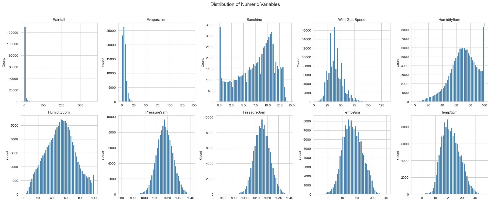
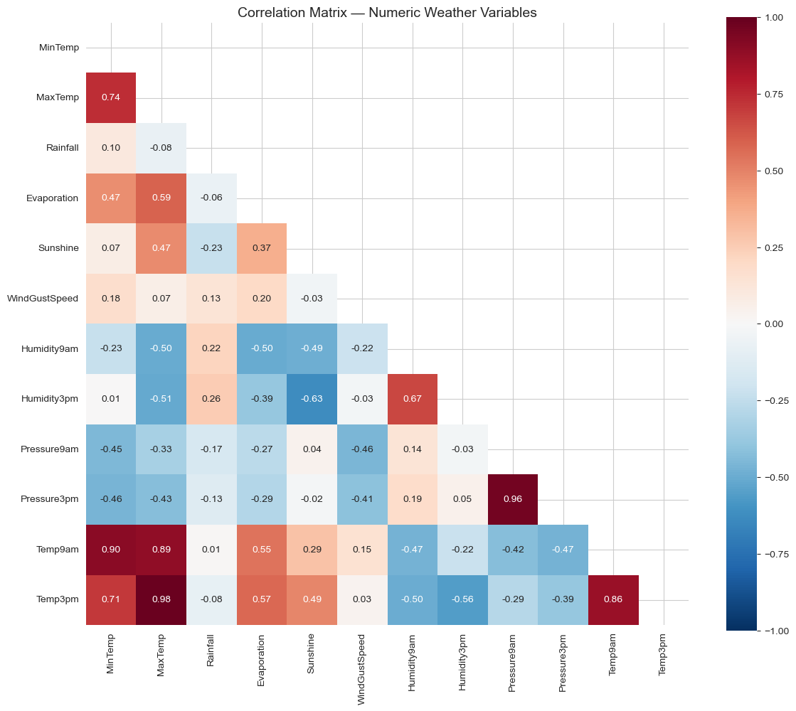
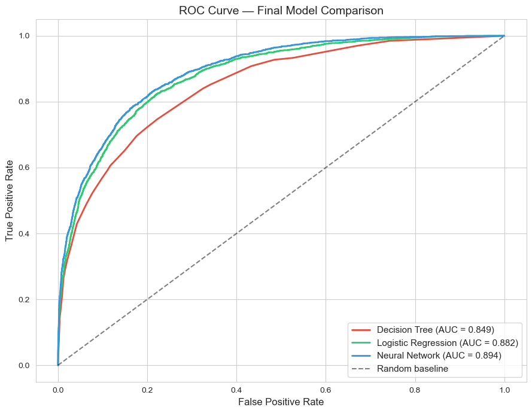

# **M Y    P O R T F O L I O**

## This is my professional Data portfolio. 

On folder [projects](./projects/), you will see:

## **1** - End to End EDA with Python

The first project, named [One Million](./projects/One-Million-08082024.ipynb), although it is a .ipynb file, you can visualize it in this platform. 
If you want to check whether the code is running, so the most efficient tool in this case is Jupyter Notebooks (or Jupyter Labs). 
For that, it's highly recommended to use Anaconda browser, with Jupyter Notebooks/Labs installed. 

### Workflow Overview

1.1. **Dataset Acquisition**  
   - The dataset used is "A Million News Headlines," sourced from Kaggle. The dataset was accessed using the Kaggle API, downloaded, and unzipped for use.

1.2. **Data Exploration**  
   - Libraries such as pandas, numpy, and nltk were imported to perform data manipulation and analysis.
   - The dataset was loaded using pandas, and initial exploratory steps included familiarizing with the structure of the data (e.g., columns and data types).
   - Data cleaning involved handling text, removing unnecessary characters, and preparing it for further analysis.

1.3. **Exploratory Data Analysis (EDA)**  
   - Conducted an initial investigation of the most used words in the dataset to infer trending topics over time.
   - Removed stopwords and used regex to clean the text data.
   - Used itertools and collections to analyze combinations of commonly occurring words and phrases.

1.4. **Data Analysis**  
   - Analyzed the headlines dataset by calculating word frequencies and identifying trends across different time periods.
   - Investigated correlations between the frequency of specific keywords and their prominence in news over different years.
   - Created combinations of common words to understand more complex relationships in news headlines.

1.5. **Visualizations**  
   - Created visualizations using matplotlib and seaborn to display insights from the data.
   - Included bar charts` and line charts to depict the trending topics over time, seasonal changes in word frequency, and popular keywords.

1.6. **Findings**  
   - The analysis provided insight into the trending topics in Australia over the years, with a focus on identifying hot topics and important events based on headline data.
   - Recommendations were formed regarding which topics have gained or lost prominence over time, offering insight into the evolution of public interest.

## **2** - End to End Business Analysis Dashboard using SQL Server, Data Modelling and Power BI

The second project was made using MS SQL Server and Power BI project and was created for a fictional business called [BikeStoreProject](https://app.powerbi.com/groups/me/reports/442ff52a-57b7-450b-938c-cf1c5b04866b?pbi_source=desktop). The database is spread into three files: [bike_share_yr_0](./miscelaneous/bike_share_yr_0.csv), [bike_share_yr_1](./miscelaneous/bike_share_yr_1.csv) and [cost_table](./miscelaneous/cost_table.csv)  

In the dashboard above, we have the following metrics:

2.1. **Years Selection:** Options for selecting data for the years 2021 or 2022.

2.2. **Key Metrics:**
   - **Riders:** 3 million total riders.
   - **Profit-to-Revenue Ratio:** 0.45.
   - **Total Revenue:** $15 million.
   - **Total Profit:** $10.45 million.

2.3. **Profit Prediction Summary:**
   - High-revenue times are between noon and the first hours of the night, especially from Tuesday to Friday.
   - **Hourly Revenue Table:** Revenue breakdown for each hour of the day (0-23 hours).

2.4. **KPI Over Time Chart:**
   - Displays riders, average profit, and average revenue trends monthly for 2021 and 2022.

2.5. **Revenue by Season Chart:**
   - **Winter:** $4.9 million.
   - **Fall:** $4.2 million.
   - **Summer:** $3.9 million.

2.6. **Rider Demographic:**
   - **Casual Riders:** 18.83%.
   - **Registered Riders:** 81.17%.
     
You can access the dashboard clicking on the link above, if you have access to a Microsoft Fabric / Power BI app, or, alternatively, you can check the [pdf file](./miscelaneous/BikeStoreProject.pdf) uploaded - SQL Query included.

## **3** - End to End App Investment Analysis using SQL as its core, in a Jupyter Notebook, through Python Libraries.

## Scenario Overview

In this scenario, the stakeholder is an app developer aiming to create a successful, marketable app. To achieve this, the developer seeks to understand the most popular app categories, optimal pricing strategies, and how to maximize platform user ratings.

### Workflow Overview

3.1. **Dataset Acquisition**  
   We sourced appropriate datasets from Kaggle.com to support our analysis.

3.2. **Data Exploration**  
   We used SQL to become familiar with the data and determine which columns would be primarily used in the analysis. The main objective was to identify opportunities for investment by examining key metrics within the dataset.

3.3. **Exploratory Data Analysis (EDA)**  
   After a preliminary examination of the data, we began an Exploratory Data Analysis (EDA). This involved data cleaning and verifying compatibility between dataset frames to ensure consistency.

3.4. **Data Analysis**  
   We executed several queries to uncover insights, including analyses of:
   - The most numerous app genres.
   - User ratings in combination with price ranges and genres.
   - The lowest-rated app genres.
   - Correlations between app description length and average user ratings.
   - Correlations between average ratings and the number of languages provided by the app.
   - Genres that are least common among the lowest-rated categories.
   - The relationship between app price range, number of apps, and average user ratings.

3.5. **Visualizations**  
   We utilized various dashboard visualizations available on Jupyter Notebook, such as stacked bar charts, grouped bar charts, and heat maps, some enhanced with labels. Additionally, we employed a Python Bubble chart visualization for a specific insight.

3.6 ## Recommendations

Based on our findings, we crafted several recommendations:

- **Target Underserved Categories**  
  Consider developing an app in underrepresented, low-rated categories such as Catalogs, Finance, and Navigation. These categories present potential opportunities due to their smaller number of apps, which means less competition. A well-designed app with superior user experience could fill existing gaps and capitalize on the lack of strong contenders.

- **Books Category Investigation**  
  For the Books category, further investigation is needed to determine whether the low ratings are due to content quality or the e-reader functionality. Clarifying this could reveal whether this area presents a viable opportunity for development.

- **Pricing Model**  
  We recommend launching a paid app priced between USD 1.00 and USD 4.00 or adopting a freemium model. This model allows attracting a larger initial user base by offering basic features for free while monetizing through premium options.

- **Language Support**  
  Supporting multiple languages could increase the app's reach and appeal in global markets.

The codes for this project above can be verified on my [AppleStore Analysis file](./projects/App%20Apple%20Store%20Analysis/AppleStore_Analysis__V0.ipynb) 

## **4** - Australian Weather Prediction — Will It Rain Tomorrow?

The fourth project, Weather Prediction, uses 10 years of Bureau of Meteorology (BOM) data from 49 locations across Australia to predict next-day rainfall. Three classification models — Decision Tree, Logistic Regression, and Neural Network (MLP) — are trained, tuned, and compared across 145,490 observations.

### Workflow Overview

4.1. **Data Understanding & Type Validation**
   - Loaded a 145,490-record dataset with 27 features and corrected data-type mismatches against BOM variable descriptions, including date parsing, cloud cover capping (oktas 0–8), and ENSO case standardisation.

4.2. **Statistical Exploration**
   - Computed summary statistics and skewness for all numeric variables. Rainfall (skewness 9.84) and Evaporation (3.76) showed heavy right skew; Humidity, Pressure, and Temperature variables were approximately symmetric.
   - Answered domain-specific questions: longest sunshine day (Mildura, 14.5 hrs), average MaxTemp at Uluru under southerly winds (31.13°C), top rainfall locations in 2017 (Darwin leading at 1,739 mm), and wind direction frequency on rainy days (westerly directions dominating).

4.3. **Visual Exploration**
   - Produced distribution plots, correlation heatmaps, and scatterplots. Identified five highly correlated variable pairs (e.g., MaxTemp ↔ Temp3pm: r = 0.985, Pressure9am ↔ Pressure3pm: r = 0.961) and flagged treatment recommendations for downstream modelling.

4.4. **Data Preparation**
   - Handled missing values, capped out-of-range cloud cover values, and one-hot encoded categorical variables via `pd.get_dummies()`. Final modelling dataset: 58,090 records × 114 features, with a 21.9% positive class balance.

4.5. **Predictive Modelling**

   - **Decision Tree:** Default tree overfit severely (AUC 0.706). GridSearchCV tuning (`max_depth=5`) resolved overfitting and raised AUC to 0.853. **Humidity3pm** was the first split variable in both models.
   - **Logistic Regression:** Standardised features (z-score). Achieved AUC 0.883 with no overfitting. Top predictors: Pressure3pm (−1.34), Humidity3pm (+1.20). RFE reduced features from 114 to 85 with negligible accuracy impact.
   - **Neural Network (MLP):** Default model overfit (11-point train-test gap). GridSearchCV (`alpha=0.001`, `hidden_layer_sizes=(5,)`) resolved overfitting and achieved AUC 0.894. Pre-selecting features via the Decision Tree's importance ranking cut convergence from 300 to 21 iterations.

4.6. **Findings**
   - The tuned Neural Network achieved the highest AUC (0.894) and was selected as the best model. **Humidity3pm** was the strongest predictor across all three model types. Hyperparameter tuning was essential — the default Decision Tree's AUC improved from 0.706 to 0.849 after tuning. Feature transfer across models cut MLP convergence time by ~90%.

All the codes for this project are [here](./projects/weather%20prediction/weather_prediction_jupyter_v1.ipynb).
